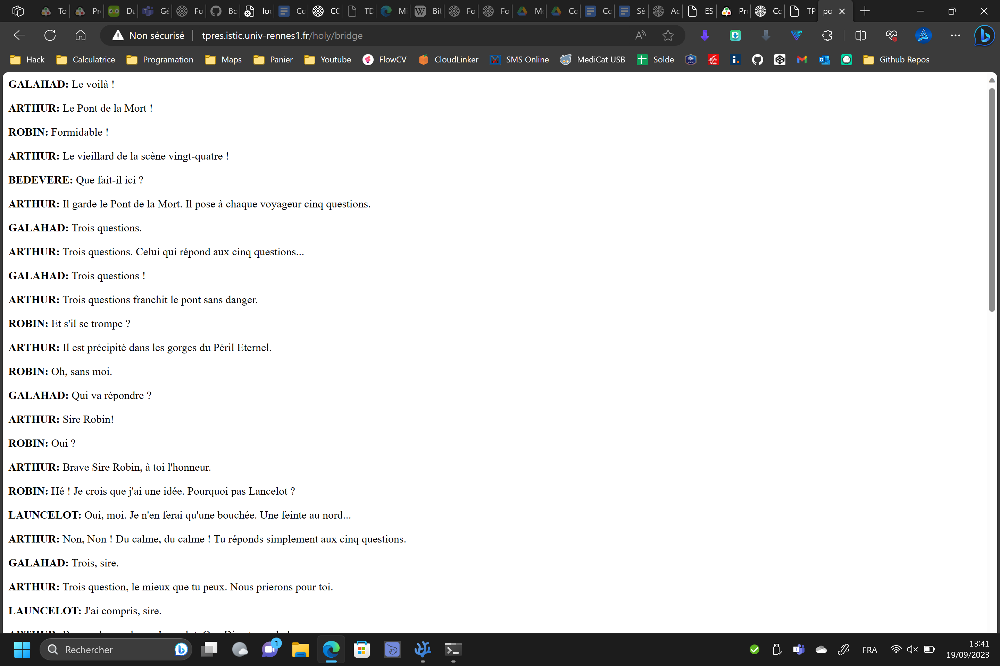

# Question 1

En éxécutant la commande :
```bash
echo -ne 'GET /index.html HTTP/1.0\r\n\r\n' | nc TPRES.istic.univ-rennes1.fr 80
```
On obtient :
```
HTTP/1.1 200 OK
Date|Tue, 19 Sep 2023 11:28:05 GMT
Server|Apache/2.4.57 (Unix)
Last-Modified|Mon, 11 Jun 2007 18:53:14 GMT
ETag|"2d-432a5e4a73a80"
Accept-Ranges|bytes
Content-Length|45
Connection|close
Content-Type|text/html

<html><body><h1>It works!</h1></body></html>
```

Voici les différentes métadonnées et leur valeurs associés


|Métadonnées|Valeurs|
|---|---|
|Date|Tue, 19 Sep 2023 11:28:05 GMT|
|Server|Apache/2.4.57 (Unix)|
|Last-Modified|Mon, 11 Jun 2007 18:53:14 GMT|
|ETag|"2d-432a5e4a73a80"|
|Accept-Ranges|bytes|
|Content-Length|45|
|Connection|close|
|Content-Type|text/html|

# Question 2

```bash
echo -ne 'GET /holy/bridge HTTP/1.0\r\n\r\n' | nc TPRES.istic.univ-rennes1.fr 80
```
Nous donne

```
HTTP/1.1 200 OK
Date: Tue, 19 Sep 2023 11:38:53 GMT
Server: Apache/2.4.57 (Unix)
Content-Location: bridge.en.txt
Vary: negotiate,accept,accept-language,accept-charset
TCN: choice
Last-Modified: Mon, 12 Sep 2022 12:56:14 GMT
ETag: "ac4-5e87a6bb17780;60594f223e000
Accept-Ranges: bytes
Content-Length: 2756
Connection: close
Content-Type: text/plain
Content-Language: en

GALAHAD:  There it is!
ARTHUR:  The Bridge of Death!
ROBIN:  Oh, great.
ARTHUR:  Look!  There's the old man from scene twenty-four!
BEDEVERE:  What is he doing here?
ARTHUR:  He is the keeper of the Bridge of Death.  He asks each traveler five
    questions--
...
```

Et si on regarde dans un navigateur



En apparence, les entêtes ne s'affichent pas dans le navigateur. 


Ici on essaie de changer la langue, la capacité d'encodage (gzip) et le type de texte retourné:
```bash
echo -ne 'GET /holy/bridge HTTP/1.0\r\nAccept-Encoding: gzip\r\nAccept: text/html\r\nAccept-Language: fr\r\n\r\n' | nc TPRES.istic.univ-rennes1.fr 80
```

```
echo -ne 'GET /holy/bridge HTTP/1.0\r\nAccept-Encoding: gzip\r\nAccept: text/html\r\nAccept-Language: fr\r\n\r\n' | nc TPRES.istic.univ-rennes1.fr 80
HTTP/1.1 200 OK
Date: Tue, 19 Sep 2023 11:55:01 GMT
Server: Apache/2.4.57 (Unix)
Content-Location: bridge.fr.utf8.html
Vary: negotiate,accept,accept-language,accept-charset
TCN: choice
Last-Modified: Mon, 12 Sep 2022 12:56:14 GMT
ETag: "db8-5e87a6bb17780;60594f223e000
Accept-Ranges: bytes
Content-Length: 3512
Connection: close
Content-Type: text/html; charset=utf-8
Content-Language: fr

<html>
<head>
<title>pont</title>
</head>
<body>
<p><b>GALAHAD:</b>  Le voilà !</p>
<p><b>ARTHUR:</b>  Le Pont de la Mort !</p>
<p><b>ROBIN:</b>  Formidable !</p>
<p><b>ARTHUR:</b>  Le vieillard de la scène vingt-quatre !</p>
<p><b>BEDEVERE:</b>  Que fait-il ici ?</p>
<p><b>ARTHUR:</b>  Il garde le Pont de la Mort. Il pose à chaque voyageur cinq questions.</p>
...
```

# Question 3
On constate que le contenu à été changer en balise HTML et que le texte a été traduit en Français. Cependant la compression GZIP n'a pas eu effet, surement car le serveur ne le supporte pas.

J'ai aussi essayer avec d'autres langue : es,it,... mais ces langues ne doivent pas être supportés et sont par défaut traduit en anglais.

On peut alors en déduire que les champs Accept* sont pour la plupart les paramètres qui vont être défini par le navigateur.